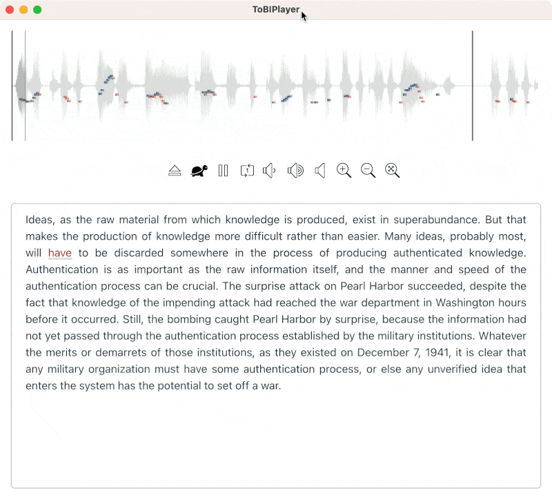

# ToBI Player

> [!TIP]
> 目前此项目已经演化成 [Enjoy App](https://1000h.org/enjoy-app/)，或转向 https://github.com/xiaolai/everyone-can-use-english 查看……


这是我用来播放短语音文件的小工具，主要用来辅助我自己的英语跟读训练。没什么特别的，就是在播放的时候，在波谱（Waveform）上多叠加了一个 “音高标注”（Pitch Contour），以便我可以直观地 “看到” 语音的音高变化 —— 这对我来说很重要，因为我是五音不全的人，识别音高有生理困难，所以，我更需要 “看到” 而不仅仅是 “听到”……

## 关于 ToBI
跟读训练（尤其是 “无他人监督的自我跟读训练”）可以参照一下计算机科学家们用来做 TTS（Text To Speech）的一个理论工具，叫做 “ToBI”（Tone and Break Index）…… 请参考 [MIT 关于 ToBI 的课程](https://ocw.mit.edu/courses/6-911-transcribing-prosodic-structure-of-spoken-utterances-with-tobi-january-iap-2006/)。

## 安装

### For Mac

我没单独申请 Apple Developer 账号 —— 所以，也没办法把这个播放器打包成 APP 分发给别人。



这不是个严肃的产品，只是自己用来解决自身需要的东西，甚至连 “玩具” 都称不上…… 有太多细节顾不上，就先这样凑合着用，毕竟，对我来说 “写程序” 并不是最主要的工作 —— 请理解。

估计想要用这个东西的人，也不是啥程序员…… 不过，想要用，就得自己安装 `nodejs`：

```bash
brew install nvm
nvm install 20.5.1
nvm use 20.5.1
```

语音文字识别，我使用的是 [stable-ts](https://github.com/jianfch/stable-ts)，略慢（相对于 [whisper.cpp](https://github.com/ggerganov/whisper.cpp)）…… 需要本地 Mac 已经[安装 Python3](https://docs.conda.io/projects/miniconda/en/latest/)，而后安装 `stable-ts`：

```bash
pip install -U stable-ts
```

> **注意** 如果不知道如何在 `Terminal` 程序中使用 `brew` 命令的话，可以先去看看[这篇文章: 《从 Terminal 开始……》](https://github.com/xiaolai/apple-computer-literacy/blob/main/start-from-terminal.md)……

然后：

```bash
git clone https://github.com/xiaolai/tobiplayer.git
cd tobiplayer
npm install
npm run dev
```

打包成 APP 自己本地使用的话，就：

```bash
npm run build:mac
```
（我还没研究明白怎么把本地的 python 脚本与 electron-builder 正确搭配…… 2023.09.23）


### For Windows

安装说明请参考For Mac部分，下面仅为For Windows的操作步骤，系统为Windows 11，终端为Windows PowerShell：

1. [下载](https://nodejs.org/dist/v20.9.0/node-v20.9.0-x64.msi)并安装Node.js；

2. 检查Node版本及是否安装正常：

   ```powershell
   npm -v
   node -v
   ```

   如果分别返回版本号，则表示安装正常。

3. 然后：

   ```powershell
   git clone https://github.com/xiaolai/tobiplayer.git
   cd tobiplayer
   npm install --save-dev electron
   npm install
   ```

   > 与Mac不同的是，在Windows上如果需先执行`npm install --save-dev electron`，否则，执行`npm install`时会报错。

4. 通过Node.js使用ToBI Player：

   ```powershell
   npm run dev
   ```

   > 该Windows PowerShell窗口需保持打开状态，不可关闭。

5. 打包成独立的程序使用ToBI Player：

   ```powershell
   npm run build:win
   ```
   打包后的独立APP在`tobiplayer`目录下的`dist`子目录内：
   
   * `tobi-player Setup 0.1.0.exe`为安装包，可安装后使用；
   
   * `win-unpacked`文件夹内的`tobi-player.exe`为免安装可以直接运行的程序。
   
   > 打包后的程序运行将不再依赖Windows PowerShell窗口，且可将安装包提供给其他人安装使用。
