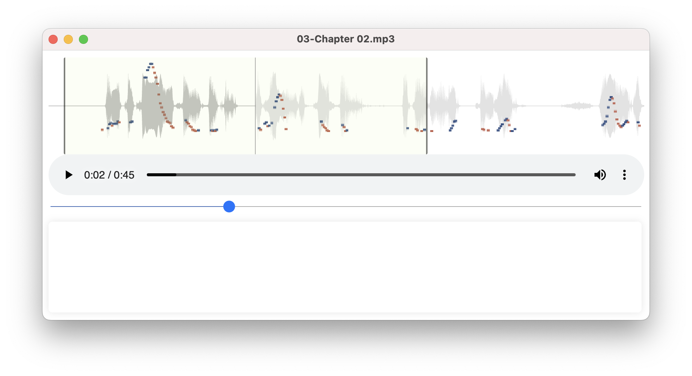

# ToBI Player

这是我用来播放短语音文件的小工具，主要用来辅助我自己的英语跟读训练。没什么特别的，就是在播放的时候，在波谱（Waveform）上多叠加了一个 “音高标注”（Pitch Contour），以便我可以直观地 “看到” 语音的音高变化 —— 这对我来说很重要，因为我是五音不全，识别音高有生理困难，所以，我更需要 “看到” 而不仅仅是 “听到”……

## 关于 ToBI
跟读训练（尤其是 “无他人监督的自我跟读训练”）可以参照一下计算机科学家们用来做 TTS（Text To Speech）的一个理论工具，叫做 “ToBI”…… 请参考 [MIT 关于 ToBI（Tone and Break Index）的课程](https://ocw.mit.edu/courses/6-911-transcribing-prosodic-structure-of-spoken-utterances-with-tobi-january-iap-2006/)。

## 安装

我没单独申请 Apple Developer 账号 —— 所以，也没办法把这个播放器打包成 APP 分发给别人。



这不是个严肃的产品，只是自己用来解决自身需要的东西，甚至连 “玩具” 都称不上…… 全都是 “又脏又快” 的做法搞出来的 —— 总计才几个小时，在 ChatGPT 的辅助下完成 —— 甚至连 App 打包我都得现学。而后，TextArea 也只是一个输入框，用来把文本拷贝粘贴在哪里，方便自己看 —— 而不是一个 “语音转文字自动识别”，哈哈…… 连添加个像样的图标都觉得不值当。

估计想要用这个东西的人，也不是啥程序员…… 不过，得自己安装 nodejs：

```bash
brew install nvm
nvm install 20.5.1
nvm use 20.5.1
```
然后，在项目目录下：

```bash
git clone git@github.com:xiaolai/tobiplayer.git
cd tobiplayer
npm install
npm start
```

打包本地使用的话，就：

```bash
npm run build
```